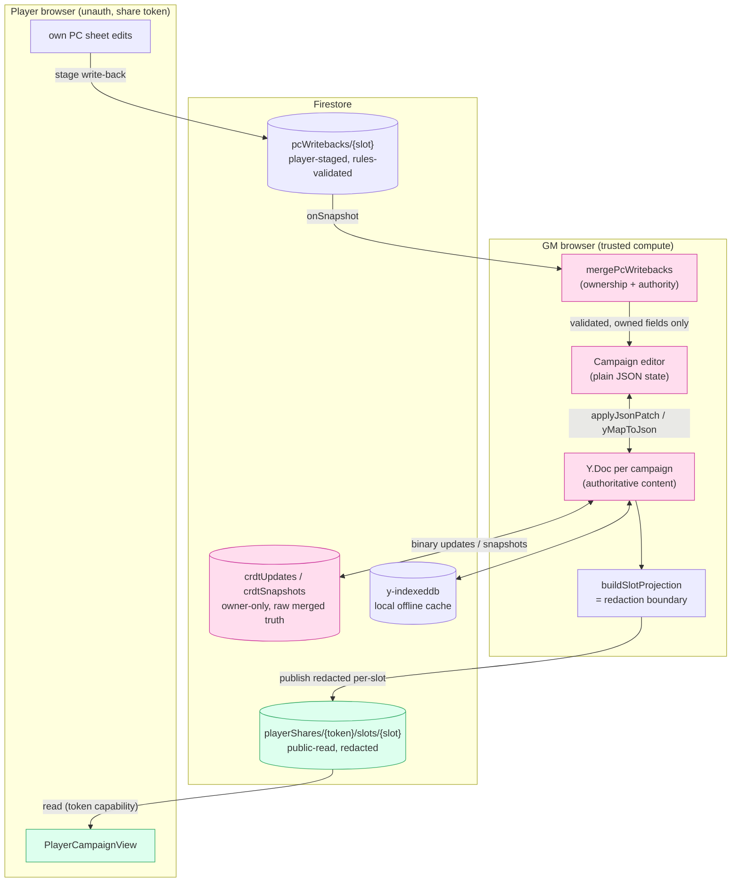

# Architecture

This document explains *how the system is built and why* — the design decisions
that aren't obvious from reading any single file, and the tradeoffs each one
buys. It focuses on the parts that are genuinely non-trivial: the player
visibility model, the public-read share design, the no-auth player access path,
the offline-first CRDT sync layer, and the player write-back merge. For the
day-to-day editor data flow see [docs/offline-sync.md](./docs/offline-sync.md);
for the security review of Player Mode see
[docs/player-mode-audit.md](./docs/player-mode-audit.md).

gamemaster-builder is a Next.js 15 + Firebase (Auth + Firestore) app. There is
**no application server of our own for campaign data** — the GM's browser is the
trusted compute node, Firestore is storage + pub/sub, and players are
unauthenticated read-mostly clients. Two consequences fall out of that and shape
everything below:

1. We cannot run trusted server-side redaction, so **redaction happens in the
   GM's browser and only the redacted result is ever stored where a player can
   read it.** The projection code is therefore a security boundary, and we
   *prove* it (see [The redaction invariant](#the-redaction-invariant-proven)).
2. We cannot use the Firebase Admin SDK (the deployment's org policy blocks
   service-account-key creation), so anything that would normally be a Cloud
   Function — publishing player views, verifying Pro status — is done client-side
   with security enforced by Firestore rules instead.

---

## 1. The hybrid visibility model

Campaign content is full of GM secrets: an NPC's true goal, a faction's hidden
agenda, a location players haven't discovered. Players must see *some* of an
entity (the innkeeper's name and appearance) but not the rest (that he's an
assassin). So visibility is resolved at **two granularities**, both
fail-closed:

- **Entity-level** — is this entity visible to this player slot at all?
  `private` / `party` (everyone) / `custom` (an explicit slot allowlist).
- **Field-level** — for a visible entity, which *fields* are public? Defaults
  per entity type (`lib/playerMode/fieldDefaults.ts`) — e.g. an NPC's `name` and
  `appearance` are public, its `goal` and `method` are private — overridable
  per-instance by the GM.

The single source of truth for "what can this slot see?" is
`resolveVisibility()` (`lib/playerMode/resolveVisibility.ts`). Everything —
the publisher, the GM's "preview as player", the edge filter, the security-rules
tests — routes through it. **Anything that re-implements visibility logic
elsewhere is a bug**, because it can drift from the boundary; the codebase
enforces this convention (e.g. `graphProjection.ts` is deliberately a *pure
consumer* that makes no visibility decisions of its own).

**Why fail-closed everywhere.** A field absent from the defaults map resolves to
`private`; an entity with no visibility record is invisible; an unknown entity
type is invisible. The failure mode of a bug should be "players see too little,"
never "players see a secret." `PlayerModeData` (`types.ts`) is an explicit
allowlist of the `data` keys the projection may even read, so a brand-new GM-only
field can't accidentally drift into a player view just by existing.

---

## 2. The public-read share, and the projection security boundary

Players read from a **shadow collection** that holds only already-redacted data:

```
playerShares/{shareToken}                     ← ShareMeta (campaign name, roster, version)
playerShares/{shareToken}/slots/{slotId}      ← SlotProjection (redacted, per player slot)
```

The GM's browser computes one `SlotProjection` per roster slot
(`buildSlotProjection` in `lib/playerMode/projection.ts`) and writes them via
`publishProjections` (`lib/playerMode/publish.ts`). A slot doc is
`allow read: if true` — genuinely world-readable. That is safe **only because
the document contains nothing the slot may not see**: hidden entities are
absent, private fields are stripped, edges to hidden entities are dropped, maps
expose only player-visible layers.

### Why public-read + projection instead of per-player auth

The tempting alternative is to give each player a real account, store full
campaign data, and gate reads with security rules. We rejected it:

- **No accounts is a feature.** Players join by clicking a link — no signup, no
  password, no "create an account to see your character." For a casual TTRPG
  table this removes the single biggest source of friction.
- **Rules can't do field-level redaction.** Firestore rules gate whole
  documents, not "this field but not that one." Field-level privacy *requires*
  computing a redacted projection somewhere. With no Admin SDK / Cloud
  Functions, "somewhere" is the GM's browser.
- **The blast radius is a single redacted doc.** Because the only thing a player
  can read is the projection, a rules mistake can at worst expose *other
  redacted projections* — never raw campaign data, which lives in the
  owner-only CRDT log (§4).

The cost we accept: redaction correctness is now load-bearing, and the publish
step must re-run whenever content or visibility changes. We pay down the first
cost with a proof (§6) and the second with debounced auto-publish from the GM
session.

### Edges never betray a hidden entity

The graph relationships are the subtlest case: an edge "Sera → leaderOf →
Shadow Cabal" leaks the Cabal's existence even if the Cabal entity is hidden.
`projectEdges` publishes an edge only when **both endpoints were themselves
projected to this slot** *and* the edge's own visibility admits the slot *and*
it isn't an unconfirmed review-queue edge. Endpoints of a never-projected type
(secret, monster) fail closed automatically.

---

## 3. No-auth player access and its threat model

```
app/play/[shareToken]/page.tsx   → validate token → pick slot → PlayerCampaignView
```

The **share token is the capability.** It is high-entropy and unguessable; rules
require `shareToken.size() >= 20` to read a share. Knowing the token is
sufficient to read the (already-redacted) projections — there is no account.

Slot choice is persisted in `localStorage` (`lib/playerMode/slotStorage.ts`)
purely as a convenience so a returning player skips the picker. It is **not** a
security control: it's re-validated against the live `tokenVersion` on load, and
picking a different slot only changes which redacted doc you read — every slot
doc is already safe to read.

**Token rotation = revocation.** Rotating the token (`rotateShareToken`) mints a
new token and bumps `tokenVersion`, which makes every outstanding link's path
stop resolving and invalidates saved slot choices. This is the "kick everyone
out / regenerate link" primitive.

**Threat model, explicitly:**

| Threat | Mitigation |
| --- | --- |
| Guessing a share URL | ≥20-char high-entropy token; rules reject short tokens |
| Reading another campaign's data | Token only resolves its own `playerShares/{token}` |
| Seeing GM secrets in your own view | Redaction boundary (§2) + proof (§6) |
| One player editing another's character | Ownership guard in the write-back merge (§5) |
| A leaked link living forever | Token rotation revokes all links |
| Tampering with stored slot choice | Re-validated on load; all slot docs are read-safe anyway |

---

## 4. Offline-first CRDT sync, and why it sits where it does

Campaign content used to be a single JSON blob written to `campaigns/{id}.data`
with whole-document last-writer-wins — which silently lost edits when the same
GM had two devices/tabs open. It is now owned by a **per-campaign Yjs `Y.Doc`**
(`lib/crdt/`):

- **Local:** `y-indexeddb` persists the doc per campaign, so reloads and offline
  starts are instant and edits made offline are never lost.
- **Transport:** two append-only Firestore subcollections act as a dumb binary
  pipe — `crdtUpdates/{auto}` (each Yjs update) and `crdtSnapshots/{auto}`
  (periodic compacted state + state vector). Reconciliation is by Yjs state
  vectors; a snapshot GC pass prunes updates it subsumes. A device offline long
  enough to miss pruned updates rebuilds from `snapshot + state-vector diff`.

```
Y.Doc ──observe──▶ crdtUpdates (append)         crdtUpdates ──subscribe──▶ Y.Doc
  ▲                                                                          │
  └────────────── y-indexeddb (local) ──────────────────────────────────────┘
                  periodic compaction ──▶ crdtSnapshots (+ GC)
```

**Why a JSON↔Y.Doc adapter rather than Y types throughout.** The entire editor
is built on a plain nested-JSON `data` object and a debounced auto-save loop.
Rewriting every controlled input to read/write Y types would be a massive,
risky change. Instead `lib/crdt/yjs-adapter.ts` reconciles a new JSON snapshot
into the Y.Doc with minimal ops: objects diffed by key, **arrays of objects
diffed by stable `id`** (so two devices appending/editing different entities
converge), primitive arrays by value. This is "whole-string LWW per field,"
which is a strict improvement over whole-document LWW and keeps the editor
untouched. We explicitly *don't* use `Y.Text` — character-level merge is
overkill for prep notes and would touch every call site. The tradeoff:
simultaneous edits to the *same* string field resolve last-writer-wins rather
than merging character-by-character. (See [docs/offline-sync.md](./docs/offline-sync.md).)

**Reconciling with the legacy `campaigns/{id}.data` field.** The Y.Doc is now
authoritative for content. Backups and campaign-copy read the *merged* state by
folding the CRDT log into a throwaway Y.Doc (`lib/crdt/export.ts`), **not** the
legacy field. The legacy field is still mirrored on save for compatibility, but
consumers that need the current truth go through the CRDT log.

**Rules.** `crdtUpdates` / `crdtSnapshots` are **owner-only** (read + append;
no in-place update; delete only on the owner's GC path). Players never touch
them — graph edges live *inside* the Y.Doc, so they ride this owner-only log and
reach players only as redacted edges baked into the public projection. This is
why the CRDT layer sits "below" the projection: raw merged truth is owner-only;
the projection is the only thing that crosses to players.

---

## 5. Player write-back and the authored merge

Players can edit a small, safe slice of *their own* character sheet (HP,
conditions, death saves, notes, goals…) during play. Because players are
unauthenticated, they can't write campaign content directly. Instead they stage
a write-back:

```
players ──setDoc──▶ campaigns/{id}/pcWritebacks/{slotId}   (validated by rules)
GM browser ──onSnapshot──▶ mergePcWritebacks ──▶ React state ──▶ Y.Doc autosave
GM browser ──delete──▶ (writeback consumed)
```

The Firestore rule (`isValidPlayerWriteback`) proves the writer holds the share
token, the slot is real (a projection doc exists for it), and the payload keys
are within the player-editable allowlist. What it **cannot** prove is that the
targeted `pcId` actually belongs to that slot — PC ownership lives *inside the
Y.Doc*, which rules can't read. So the GM-side reconciler is the enforcement
point, and the merge that does it is authored, domain-specific logic that Yjs
cannot provide on its own (`lib/crdt/writeback-merge.ts`):

- **Ownership guard.** A write-back staged at `pcWritebacks/{slot}` may only
  modify a PC owned by that slot. Without this, slot A could stage a write-back
  referencing slot B's PC and the reconciler would apply it — one player editing
  another's character. This is also a redaction concern: writes must never cross
  into another slot's data.
- **Field-authority policy.** For the player-editable fields the *player* is the
  source of truth (they track their own HP in the moment), so their value wins
  on conflict. Every other field is GM-authoritative and dropped. Tradeoff,
  stated honestly: a player's stale write to a player-field can overwrite a
  concurrent GM edit to that same field, because we have no per-field GM-edit
  timestamp; we accept that because live self-tracking is the common case.
- **Deterministic concurrent resolution.** All pending write-backs are merged in
  one pass — last-writer-wins by client timestamp, tie-broken by slot id — so
  the result is independent of Firestore event arrival order. This fixed a real
  lost-update race in the old per-event read-modify-write reconciler.

**Why this counts as "CRDT merge logic":** Yjs merges the *resulting* PC array
generically, but it has no concept of *who* edited or *whether they were
allowed to*. This layer resolves the domain conflict (player live-state vs GM
authority, and cross-slot ownership) into a single authoritative value, then
hands that to the Y.Doc, which merges it generically with everything else.

---

## 6. The redaction invariant (proven)

The projection declares itself the security boundary; we don't just trust it. A
`fast-check` property suite generates **arbitrary adversarial campaign state** —
entities with random visibility, partial field reveals, PCs with random
ownership, edges between hidden/dangling endpoints, multi-slot rosters — feeds it
to the **real** projection, and asserts the invariant holds:

- `lib/playerMode/__tests__/redaction.property.test.ts` — entities, fields,
  edges, session log, the PC-ownership bypass, and the read-only graph consumer
  (invariants I1–I9).
- `lib/maps/__tests__/playerProjection.property.test.ts` — map layer/marker/edge
  visibility and GM-field stripping (M1–M5).
- `lib/crdt/__tests__/writeback-merge.property.test.ts` — the intersection:
  after an arbitrary player write-back merges into campaign state, re-projecting
  *still* upholds the invariant, and a player write can never mutate GM
  visibility config or cross into another slot's data.

The generators (`lib/playerMode/__tests__/arbitraries.ts`) are shared between
the redaction proof and the merge proof, so the merge is tested against the same
adversarial space the boundary is. If a property ever fails, it has found a real
privacy leak: fix the projection and pin the shrunk counterexample as a
regression case.

---

## Data & visibility flow



The single one-way door from GM-secret data (pink) to player-visible data
(green) is `buildSlotProjection`. Everything a player can read has passed
through it; everything a player can write passes back through `mergePcWritebacks`
under the ownership guard. Those two functions are the entire trusted surface,
and both are covered by the property suite in §6.
