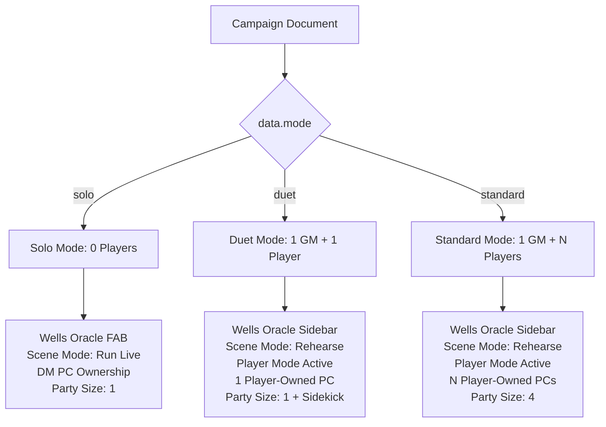

# Campaign Modes Architecture

This document details the architectural separation and UI/UX conventions for the three campaign modes: **Solo**, **Duet**, and **Standard**. These modes govern target counts, character sheet ownership, visibility rules, and active play panels to perfectly adapt the workspace for various TTRPG group sizes.

---

## 1. Mode Definitions & Scope



### Solo Mode (Zero Players)
- **Concept**: A single human acts as both the Game Master (GM) and the Player Character (PC), using the application for solo roleplaying.
- **Key Characteristics**:
  - The **Wells Oracle** is highly visible as a floating action button (FAB) in the lower-right corner.
  - **Scene Mode** acts as the live play interface (copy reads "Begin Scene" and npc dialogue outputs directly to the narrative logs).
  - Player-sharing controls, rosters, and the **Player Mode** tab are completely hidden.
  - All character sheets are forced to `ownerType: 'dm'`.
  - The Encounter Builder party size defaults to **1**.

### Duet Mode (1 GM + 1 Player)
- **Concept**: Classic single-player TTRPG play (e.g., D&D Essentials Kit style).
- **Key Characteristics**:
  - The **Wells Oracle** is moved into the GM sidebar to clear room for campaign notes.
  - **Scene Mode** acts as a draft or testing sandbox ("Rehearse Scene") to simulate NPC conversations prior to session play.
  - The **Player Mode** tab is active for generating public-read projections.
  - Enforces a rule where **exactly one PC sheet** can have `ownership.ownerType: 'player'` linked to the single player roster slot. Other sheets are sidekicks or minor companion NPCs.
  - The Encounter Builder party size defaults to **1** with a **"Include sidekick (+1)"** toggle checkbox.

### Standard Mode (1 GM + Multiple Players)
- **Concept**: Conventional TTRPG group play with a DM and 3-6 players.
- **Key Characteristics**:
  - The **Wells Oracle** is in the GM sidebar.
  - **Scene Mode** is in "Rehearse" mode.
  - The **Player Mode** tab is active and supports multiple distinct player roster slots and sibling slot projections.
  - **Multiple character sheets** can be owned by players (linked to their respective slot IDs).
  - The Encounter Builder party size defaults to **4**.

---

## 2. UI & Design System Conventions

To assist GMs in identifying their active playing environment at a glance, the interface adopts a unified, color-coded design language:

| Campaign Mode | Accent Color | Hex Code / Tailwind Class | Application In UI |
|---|---|---|---|
| **Solo** | **Rose** (Pink) | `#f43f5e` / `text-rose-500` | Solo mode badge, Wells Oracle FAB, Solo adaptation hints |
| **Duet** | **Teal** | `#0d9488` / `text-teal-600` | Duet mode badge, Duet adaptation hints |
| **Standard** | **Brass / Slate** | Browser Theme Defaults | Standard group badge, Default editor typography |
| **Player Input** | **Amber** | `#d97706` / `text-amber-600` | Player-mode edits, writeback icons, pending changes |

---

## 3. Data Schema & PC Ownership

The campaign mode is tracked at the top-level of the campaign data payload, alongside metadata tracking for backwards-compatibility migrations:

```typescript
type CampaignMode = 'solo' | 'duet' | 'standard';

interface CampaignData {
  mode: CampaignMode;                 // The active campaign mode
  modeMigratedAt?: number;           // Unix MS timestamp of soloMode migration
  legacySoloMode?: boolean;          // Preserved historical soloMode toggle value
  
  pcs: PlayerCharacter[];            // List of party PCs
  // ... rest of campaign data
}
```

### PC Ownership Schema
Under Duet and Standard modes, character sheets can represent player-controlled assets or GM-managed sidekicks and NPCs. This is tracked inside the PC object:

```typescript
type PcOwnerType = 'dm' | 'player';

interface PcOwnership {
  ownerType: PcOwnerType;
  playerSlotId?: string;             // FK to a roster member in playerRoster
}

interface PlayerCharacter {
  id: string;
  name: string;
  ownership: PcOwnership;            // Tracks DM vs Player authority
  // ... sheet details
}
```

*Rule Validation*: During PC creation or updates under Duet mode, the application checks if a player-owned character already exists. If it does, the option to set ownership to `player` is disabled for subsequent PCs to enforce the single-player constraint.

---

## 4. Book-Grounded Section Targets

Target counts for campaign preparation items scale according to the active mode, pulling targets grounded in the design methodologies (CCD and Lazy DM):

| Preparation Section | Solo Target | Duet Target | Standard Target | Source Book Rule |
|---|---|---|---|---|
| **World Facts** | 6 | 8 | 10 | Collaborative Campaign Design Ch. 1 |
| **Setting Facts** | 4 | 6 | 8 | Collaborative Campaign Design Ch. 2 |
| **Factions** | 3 | 3 | 4 | CCD Ch. 2 Factions Recommendation |
| **Active Conflicts** | 2 | 2 | 3 | Collaborative Campaign Design Ch. 2 |
| **PC Goals** | 3 | 3 | 3 | Proactive Roleplaying Ch. 1 (3 concurrent) |
| **Potential Scenes** | 3 | 5 | 6 | Lazy DM Ch. 4 (1-2 scenes/hour) |
| **Secrets & Clues** | 4 | 7 | 10 | Return of the Lazy DM Ch. 6 ("Shoot for 10") |
| **Fantastic Locations** | 3 | 4 | 5 | Return of the Lazy DM Ch. 7 |
| **Important NPCs** | 4 | 6 | 8 | Return of the Lazy DM Ch. 8 |
| **Relevant Monsters** | 3 | 5 | 6 | Return of the Lazy DM Ch. 9 |
| **Magic Item Rewards** | 2 | 3 | 4 | Return of the Lazy DM Ch. 10 |

---

## 5. First-Run Tours (Tours Engine)

Lightweight, interactive tours are rendered using the `Tour` component when a GM creates or opens a campaign in a specific mode for the first time. The tours introduce mode-exclusive components and layout changes:

- **Solo Tour Steps**:
  1. Highlight `[data-oracle-button]` introducing the floating **Wells Oracle** for quick prompts.
  2. Highlight `[data-scene-mode-tab]` demonstrating how to run scenes turn-by-turn.
  3. Highlight `[data-living-world-tab]` describing how clock timers and factions advance.
- **Duet Tour Steps**:
  1. Highlight `[data-player-mode-share]` highlighting the writeable player sheet share link.
  2. Highlight `[data-pc-ownership]` outlining player ownership over a designated character sheet.

*Retention*: Tour views are tracked and saved once per user profile to prevent repeating tooltips.
