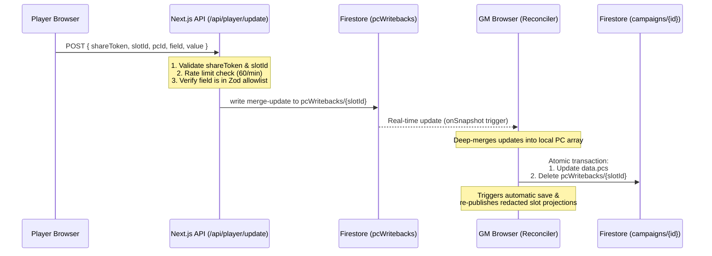

# Player Mode

A player-facing, read-only view of a campaign, reached via a share link. Players
see only what the GM reveals — party-wide by default, with per-player overrides.
No player accounts: players pick a name from a GM-defined roster and the choice
is remembered in `localStorage`.

> Design history and the rejected alternatives are in
> `docs/player-mode-audit.md`. Deferred ideas live in
> `docs/player-mode-future.md`.

## Why this shape (the constraints)

This deployment **cannot create Firebase service-account keys** (org policy), so
the Admin SDK is unavailable for new features and there are **no Cloud
Functions** deployed. It also stores an entire campaign as **one Firestore
document** (`campaigns/{id}.data`), not per-entity collections. Those three facts
ruled out the "obvious" design (anonymous-auth custom claims + a Cloud Function
shadow-collection writer keyed by entity id).

Instead: **the GM's own browser** — which already holds full, authenticated
access to the campaign — computes the redacted, per-player payloads and publishes
them to **public-read** documents. Players read those directly with real-time
listeners. The unguessable share token in the URL/path is the capability.

## Data model

```
campaigns/{id}.data.player : PlayerConfig          // GM-only (campaign doc)
  shareToken       : string   // unguessable; in the /play/<token> link + path
  tokenVersion     : number   // bumped on rotation
  roster           : RosterSlot[]   // { slotId, displayName, color?, createdAtMs? }
  fieldDefaults    : { [entityType]: { [field]: 'public'|'private' } }
  entityVisibility : { [entityType]: { [entityId]: EntityVisibility } }
  handouts?        : EntityVisibility            // gates the single handouts string

campaigns/{id}.data.playerLog : PlayerLogEntry[]   // GM-only narration source
  { id, text, mentions:[{entityType,entityId,label}], visibility, authorRef, postedAtMs }

EntityVisibility = { mode: 'private'|'party'|'custom', allowedSlotIds?, fieldOverrides? }
```

Published (public-read, GM-write) docs that players consume:

```
playerShares/{shareToken}                  : ShareMeta
  { campaignId, campaignName, tokenVersion, roster }
playerShares/{shareToken}/slots/{slotId}   : SlotProjection
  { campaignName, tokenVersion, slotId, entities, handouts, sessionLog, updatedAtMs }
```

Entities are arrays in `campaign.data` (some historically lacked ids). The
idempotent migration (`lib/playerMode/migration.ts`, run on GM open via
`ensurePlayerModeInitialized`) backfills ids on `npcs/locations/factions/clocks`,
seeds the player config, and migrates legacy `isPublic` flags to `party`.

## The visibility resolver (single source of truth)

`lib/playerMode/resolveVisibility.ts` decides, for one entity and one slot:
is the entity visible, and which fields. Precedence:

1. Unknown entity type → fully private (fail-closed).
2. Entity-level: `private` hides all; `party` shows to everyone; `custom` shows
   only to `allowedSlotIds`.
3. Field-level (visible entities only): per-instance `fieldOverrides[field]`
   wins over the campaign `fieldDefaults[entityType][field]`; a field listed in
   neither is **private** (fail-closed).

This function is used by the projection builder, the GM "preview as player"
panel, and is mirrored by the rules tests. **Do not duplicate visibility logic
elsewhere** — extend the resolver (Heuristic-drift rule).

## Projection flow (the "writer")

`lib/playerMode/projection.ts` (`buildShareMeta`, `buildSlotProjection`) turns
the campaign + config into the public payloads, using the resolver per entity
and stripping the internal `visibility` field from log entries.
`lib/playerMode/publish.ts` (`publishProjections`) writes the meta doc + one slot
doc per roster member and **prunes** slot docs for removed members
(`staleSlotIds`). `PlayerModePanel` debounce-calls this on any relevant change,
so projections refresh live during a session.

**Limitation:** projections only update while a GM client is connected. That's
acceptable — reveals happen at the table when the GM is active.

## Security model

- Rules (`firestore.rules`): `playerShares/**` is **public-read**; **write** is
  allowed only to the GM who owns the campaign the token maps to, and a meta doc
  may only be created under a token that matches the campaign's current
  `shareToken` (so a leaked token can't be hijacked to another campaign).
  Players can never read source `campaigns/{id}` docs.
- **Field-level privacy is enforced by redaction at publish time** — private
  fields are never written into the slot doc, so they aren't on the wire.
- **Per-player secrecy is best-effort.** With no player accounts, anyone holding
  the link could read sibling slot docs via the SDK. Per-player overrides guard
  against *accidental* viewing at the table, not a determined inspector. True
  isolation would require player accounts (out of scope by spec).
- **Token rotation** (`rotateShareToken`) issues a new token + version and
  deletes the old share docs, invalidating every outstanding link.

## Reveals from the session log

Posting a narration entry (`data.playerLog`) with `@`-mentions auto-reveals the
mentioned entities (`lib/playerMode/sessionLog.ts`, `applyNarrationReveal`).
Reveals are **sticky**: `party` upgrades a private entity to party; `custom`
seeds/unions the entry's slots; nothing is ever narrowed, and editing entry text
never un-reveals.

## Player Write-Back Pipeline (Live Updates)

To support interactive play without requiring full player accounts, players can edit allowed fields on their owned Player Character (PC) sheet. These updates are securely propagated to the GM's main database via a real-time write-back reconciliation pipeline.

### Writable Fields & Security Boundary

Rather than opening the entire PC sheet to client writes, we establish a strict **field and type allowlist** defined in `lib/player/allowlist.ts`. Writable fields are restricted to high-frequency play-state fields:
- **Numerical Stats**: `hp.current` (current hit points), `hp.temp` (temporary hit points), `exhaustion` (0-6), and death saves (`deathSaves.successes` / `deathSaves.failures` [0-3]).
- **Arrays & Collections**: `conditions` (active status conditions matching SRD values), and custom text arrays: `goals`, `bonds`, `ideals`, `flaws`.
- **Freeform Notes**: `notes` for session observations and reminders.

Arbitrary fields (like ability scores, levels, or name) are rejected by server-side Zod validators, keeping the structural authority locked to the GM.

### Data Flow



1. **Submission**: The player client issues a `POST` request to `/api/player/update` with the payload `{ shareToken, slotId, pcId, field, value }`.
2. **Server Verification**: The API route verifies the `shareToken` exists, validates the slot ID is in the roster, performs rate-limiting checks (60 writes per minute per token), and parses the value using `validatePlayerField` from `lib/player/allowlist.ts`.
3. **Staging Subcollection**: If valid, the API writes a merge-update to `campaigns/{campaignId}/pcWritebacks/{slotId}`.
4. **GM Reconciliation**: The GM's browser maintains an active `onSnapshot` listener on the `pcWritebacks` subcollection. Upon catching a document:
   - It runs the reconciler (`lib/player/reconciler.ts`), applying `setNestedField` to deep-merge updates into the local campaign's `pcs` array.
   - It performs an atomic `writeBatch` containing a `delete` on the writeback document and an `update` on the parent campaign document.
   - The campaign document write triggers the standard debounce save pipeline, which automatically generates and publishes the updated public redacted slot projections.

### Rate Limiting

The API implements sliding-window rate limiting (`lib/player/rate-limit.ts`) checking `player:${shareToken}`. If a player exceeds 60 updates per minute, the server responds with a standard `HTTP 429 Too Many Requests` containing a `Retry-After` header.

## Adding visibility support to a new entity type

1. Add the type to `PLAYER_ENTITY_TYPES` in `lib/playerMode/types.ts`.
2. Add a field-privacy default map for it in `lib/playerMode/fieldDefaults.ts`.
3. If its array elements lack stable ids, add it to `ID_BACKFILL_TYPES` in
   `lib/playerMode/migration.ts`.
4. Add a `TYPE_LABELS` entry in `components/PlayerModePanel.tsx` and a `TYPE_META`
   entry (label + icon) in `components/PlayerCampaignView.tsx`.

Everything else (resolver, projection, publisher, rules) is generic.

## Tests

- Unit (vitest, `lib/playerMode/__tests__`): resolver matrix, projection
  redaction + defaults cascade, migration idempotency, slot validation, publish
  helpers, sticky reveals, roster cleanup, slot storage.
- Rules (emulator): `npm run test:rules` — GM/other-GM/player read+write matrix,
  incl. token-hijack prevention.

## Known limitations

- Projections refresh only while a GM client is open (above).
- Per-player secrecy is best-effort without accounts (above).
- String-array entities (`items`, `monsters`, `treasure`) and `spells`/`notes`
  are out of scope for field-level visibility (see audit "Entity scope").
- No app-level rate limit on the public reads (players read Firestore directly,
  not through an API); unguessable tokens + Firestore quotas are the current
  mitigation. App Check is the future hardening (`docs/player-mode-future.md`).
